<h1> How to use The Long Dark Item Marker</h1>

<ul>
  <li>
    <a href="#directory">What is an active directory, and how to set it</a>
  </li>
  <li>
    <a href="#createMarker">Create a marker</a>
  </li>
  <li>
    <a href="#editMarker">Edit a marker</a>
  </li>
  <li>
    <a href="#deleteMarker">Delete a marker</a>
  </li>
  <li>
    <a href="#editItemList">Edit an item list</a>
  </li>
  <li>
    <a href="#addItem">Add an item</a>
  </li>
  <li>
    <a href="#editItem">Edit an item</a>
  </li>
  <li>
    <a href="#removeItems">Remove items</a>
  </li>
  <li>
    <a href="#otherStuff">Other stuff</a>
  </li>
</ul>
 
 

<h2 id="directory">What is an active directory, and how to set it</h2>

An active directory is a directory on your PC where all the markers will be saved for each map.

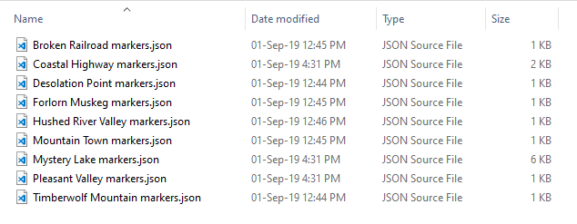

As it can be seen in the image, a JSON file is created for each map currently implemented in the application.

Each file contains all the markers and details about these:
  <ul>
    <li>Its name</li>
    <li>Its position on the map</li>
    <li>The items it holds</li>
  </ul>

While the application will work without setting an active directory, the markers will never be saved, so
  it is important to set an active directory.

 

  Setting an active directory is pretty simple. All you have to do is go to File -> Set active folder, and then a prompt
  will open for you to provide a directory.
   
  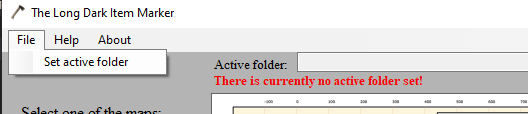

 

  If a directory is provided, then the red warning will disappear, and the active folder path can be seen in the
  interface.
   
  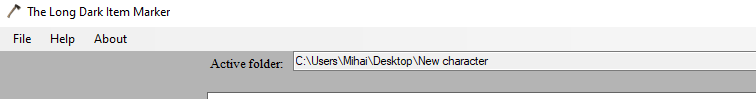

 
 
<h2 id="createMarker">Create a marker</h2>

  In order to create a marker, you must right click on the map on the location you want the marker to be placed.  
  Once you do that, an option to create a marker will appear. 
  If that is clicked, a new window will open where the marker name can be provided, and where the <a href="#editItemList">item list can be edited</a>.
   
  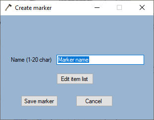

 

  Clicking on "Save marker" will save the marker on the selected map, with the specified item list (by default it's an empty list). 
  The created marker can now be seen on the map, represented by an orange rectangle.
   
  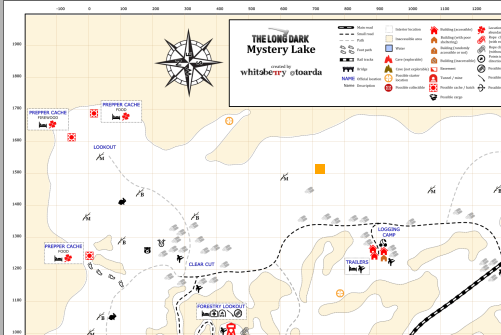

  
 
 
<h2 id="editMarker">Edit a marker</h2>

  In order to edit a marker, you must first select a marker. 
  Selecting a marker can be done by left clicking a marker on the map. 
  If a marker is selected, you'll notice the marker's color will change to green, and that details about the marker can be seen on the right side of the application. 
  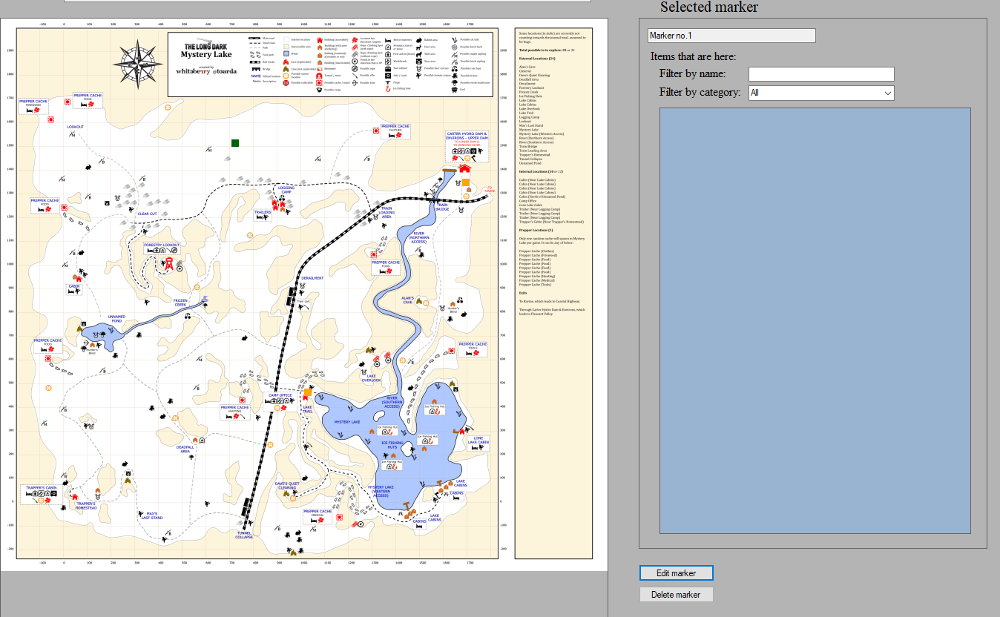

 

  After selecting a marker, you can edit it by clicking the "Edit marker" button on the bottom right portion of the main window. 
  Clicking it will open the following window: 
  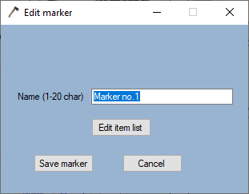

 

  From here, you can change the marker's name and <a href="#editItemList">edit the marker's item list</a>.

 
 
<h2 id="deleteMarker">Delete a marker</h2>

  To delete a marker, you must first select it, and then clicking the "Delete marker" button at the bottom right portion of the main window.

 
 
<h2 id="editItemList">Edit an item list</h2>

  This can be reached either at the creation of a marker, or when editing an existing marker, as previously mentioned. 
  In both cases, you have a button named "Edit item list". 
  Clicking it will open the following window: 
  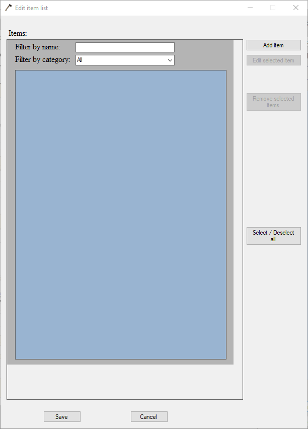

 

  As it can be seen, there are options to 
  <a href="#addItem">add items</a>, <a href="#editItem">edit items</a> and <a href="#removeItems">remove items</a>. 
  In this case, the options for editing and removing items are disabled. 
  They will be enabled once you select items (more info on this can be found in the next chapters ).

 
 
<h2 id="addItem">Add an item</h2>

  This can be reached when <a href="#editItemList">editing an item list</a>, then by clicking the "Add item" button. 
  Once the button is clicked, you'll notice the window for editing the item list will expand. 
  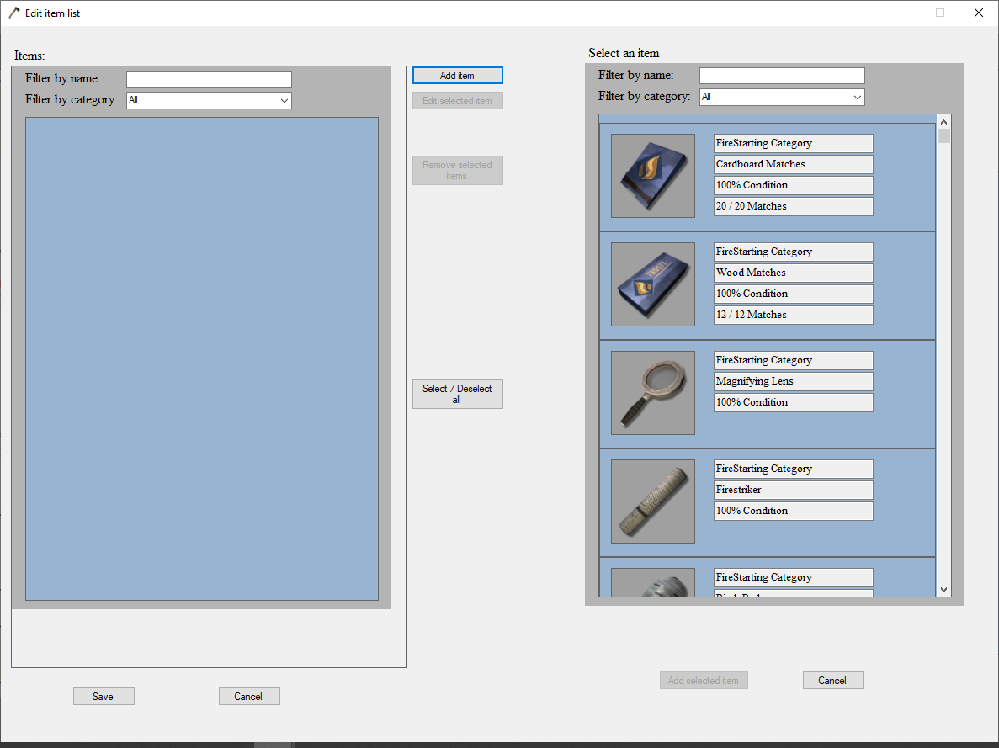

 

  Now, in order to add an item to the marker, you must select what item will be added from the right side. 
  You can also use the 2 filter options provided, in order to narrow the search of the item you wish to add. 
  Let's say you've decided to add a Firestriker. In order to do this, you must left click the Firestriker from the right side. 
  You'll then notice that the item box background color will change to green, and that  
  the "Add selected item" button is now enabled at the bottom right portion of the edit item list window. 
  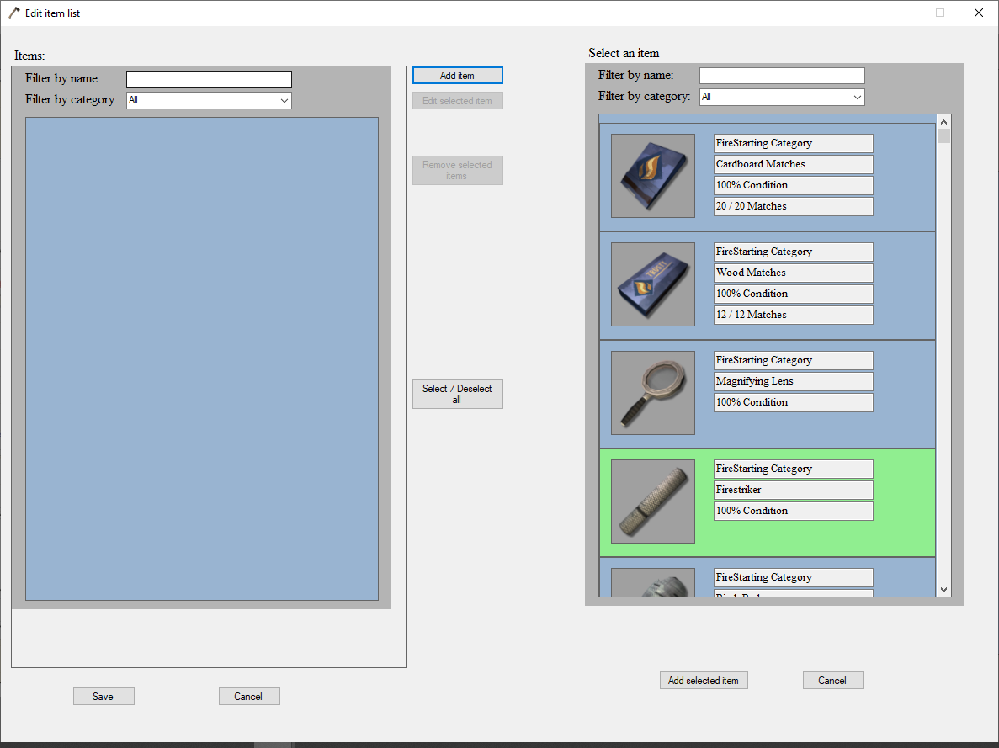

 

  If you click the "Add selected item", a new window will appear where you will provide details about the item. 
  What is actually happening, is that a copy of the item was made, and you're <a href="#editItemForm">editing it</a>. 
  After you've edited the item copy, you'll notice the item was added in the left side of the window, with the details you've provided. 
  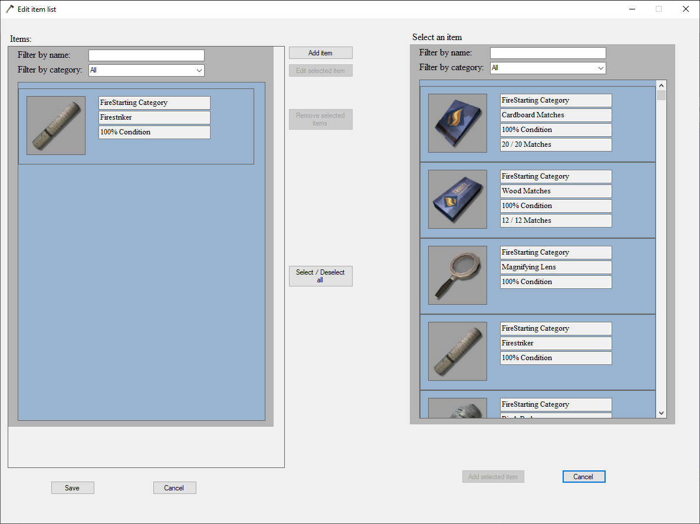

 
 
<h2 id="editItem">Edit an item</h2>

  This can be reached when <a href="#editItemList">editing an item list</a>. 
  In order to edit an item, you must first select an item (if the window is expanded, select an item from the left side). 
  You'll notice the selected item's box background color will turn to green, and the "Edit selected item" will be enabled. 
  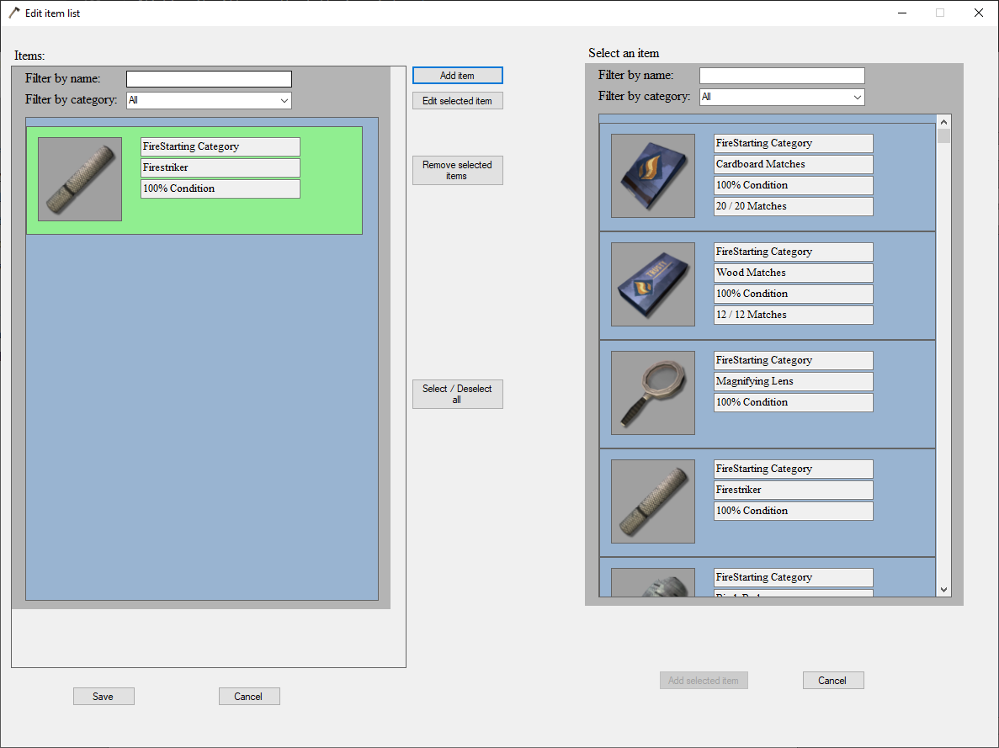

 

  If you click the "Edit selected item" button, a new window will appear, where you'll change item's details. 
  Note: The only fields you cannot edit are the item's name and category. 
  Also, there are items that have less or more fields to edit. For example, a Storm Lantern will have more fields to edit than the Firestriker has, since the 
  Storm Lantern also holds Lamp Oil. 
  
  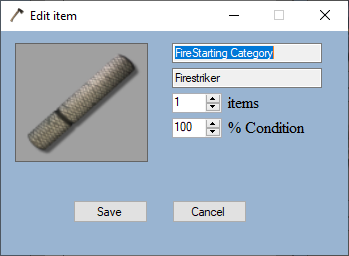

 

  For the sake of the example, let's change the Firestriker's Condition to 90%. 
  Enter 90 in the condition field, then click the "Save" button. You'll notice that the item list is now updated, with the Firestriker's condition set to 90%. 
  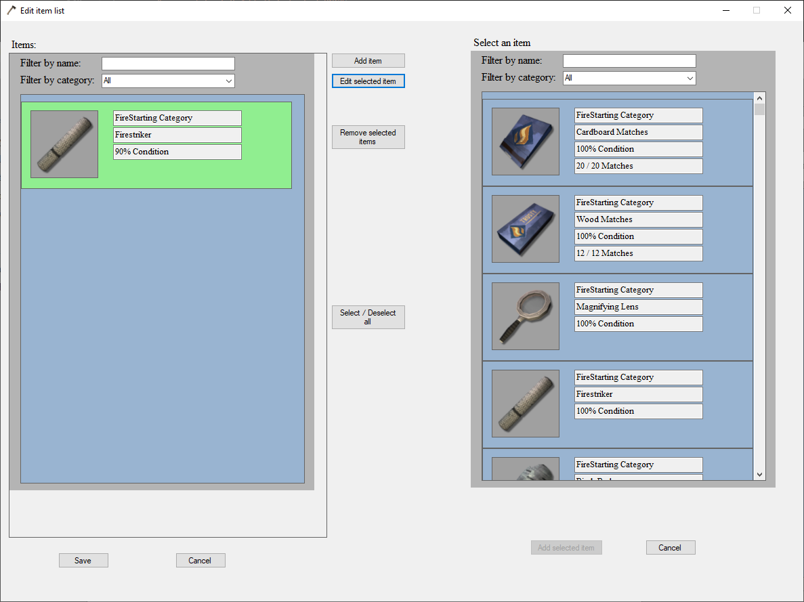

 

  Note: If there are at least 2 items selected, the "Edit selected item" will not be enabled.

 
 
<h2 id="removeItems">Remove items</h2>

  This can be reached when <a href="#editItemList">editing an item list</a>. 
  In order to remove 1 or more items, you must first select them (if the window is expanded, select the item/s from the left side).
  You'll notice tbox background color will turn to green for the selected item/s, and the "Remove selected items" will be enabled. 
  

 

  If you click the "Remove selected items" button, then the selected item/s will be removed, and the item list will be updated. 

 
 
<h2 id="otherStuff">Other stuff</h2>

  <ul>
    <li>
      Markers can be deselected by left clicking them again.
    </li>
    <li>
      Items can be deselected by left clicking them again.
    </li>
  </ul>

